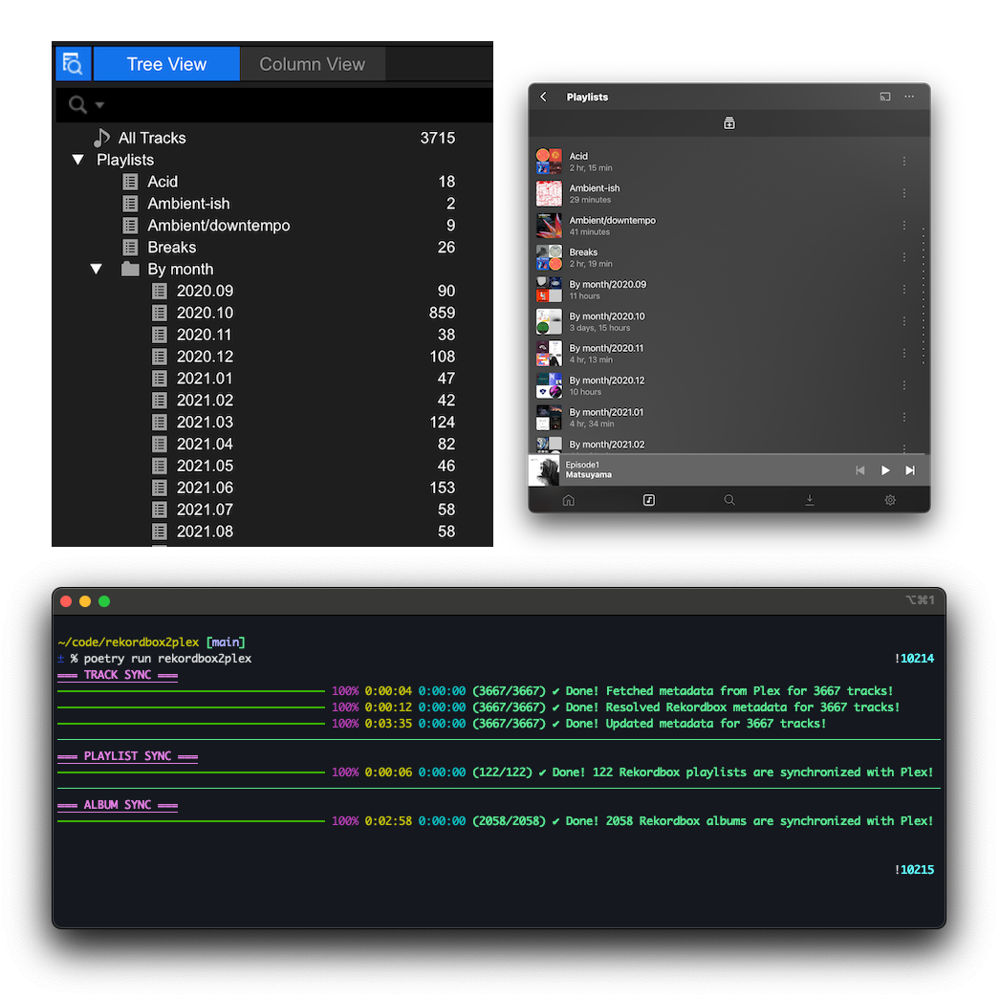

# rekordbox2plex

**rekordbox2plex** keeps Plex in sync with Rekordbox. It does three things, each its own subcommand:

- **`playlists`** — mirror your Rekordbox playlist tree into Plex (with nested-playlist flattening), using [`python-plexapi`](https://github.com/pkkid/python-plexapi).
- **`dates`** — restore Plex **"Date Added"** from when each track actually entered your Rekordbox collection (Plex has no API for this, so it's a guarded direct write to the Plex DB).
- **`parity`** — a **read-only** audit that checks whether Title / Artist / Album / AlbumArtist match 1:1 between Rekordbox and Plex, and lists tracks present in one system but not the other. Writes nothing.

It's designed for DJs who curate in Rekordbox and want the same playlists — and the real collection-entry dates — available for listening in Plex / Plexamp.



## What this does (and doesn't) do

* ✅ Read your Rekordbox playlist tree, flatten nested playlists, and create/update the equivalent playlists in Plex.
* ✅ Optionally delete Plex playlists that no longer exist in Rekordbox.
* ✅ **Sync "Date Added"** from Rekordbox into Plex (`rekordbox2plex dates`). Like playlists, Date Added is Plex-internal state that doesn't live in audio file tags — Rekordbox knows when each track entered your collection, Plex doesn't (especially after re-importing a library). This is **read-only by default** and writes directly to the Plex DB only with explicit opt-in. See [Syncing "Date Added"](#syncing-date-added).
* ✅ **Audit metadata parity** between Rekordbox and Plex (`rekordbox2plex parity`) — surfaces tag drift (Title/Artist/Album/AlbumArtist) and coverage gaps without changing anything. Comparison is whitespace/case-insensitive so only real divergence shows. See [Checking parity](#checking-parity).
* ✅ Reads Rekordbox's encrypted SQLite database with `pysqlcipher3` in read-only mode.
* ✅ Supports file path remapping (e.g. when Plex is running in Docker on a different mount than Rekordbox).
* ❌ **Does not sync track or album metadata, artwork, release year, label, etc.** — this is on purpose. The right place to fix that data is in the audio file tags themselves; once the file is correct, Plex will pick it up on its next library scan. Pushing metadata via the Plex API is fragile and fights the platform.
* ❌ Does not trigger Plex library scans for new files. Plex auto-scan or a cron job is the right tool for that.

### Why playlists only?

Playlists are the one piece of state that doesn't live in audio files — Plex stores them in its own database, and so does Rekordbox. Everything else (titles, artists, album, artwork, year, label) is best maintained inside the file tags. If your Plex library is messy, fix the tags in your DJ tool of choice; don't paper over it with API writes.

## Why this project was scaled down

Earlier versions of `rekordbox2plex` synced track titles, artists, albums, artwork, release year, label, and triggered Plex library re-indexing for new files. It worked, but it was a constant fight with Plex.

Plex's music agent re-reads file tags on every library scan. The initial plan here was to push the Rekordbox metadata via the Plex API and then lock each field so the next reindex couldn't overwrite our values. That partly worked — but Plex doesn't just re-read titles. It actively orchestrates the artist and album-artist hierarchy on every scan: merging duplicate artists, splitting tracks by `originalTitle`, deciding which artist node a track belongs to. Once we started locking fields, every scan became a battle. Plex would try to restructure the tree, our locks would block half the changes, and the result was a library that was neither the file's truth nor Plex's truth — just a frozen-in-time snapshot of our last sync, drifting further from disk every day.

The realization: **the audio file is the source of truth.** If a track's metadata is wrong in Plex, the tag in the file is wrong. Fix it there and Plex will align on the next scan. No locks, no API writes, no drift, no battling Plex.

Once that became clear, almost everything in this tool was redundant. Playlists are the one exception — they're stored in each platform's own database, not in audio files, so the only way to get Rekordbox's playlist tree into Plex is via the API.

So the metadata sync, artwork sync, field locks, orphan track/album deletion, and library-scan trigger were all removed. What's left is a single, well-defined job: **mirror the Rekordbox playlist tree into Plex**. Smaller surface, fewer dependencies, no fights with the platform.

If you need the old metadata-syncing version, the git history still has it.

## Recommended workflow for fixing metadata

If a track shows up wrong in Plex (wrong title, missing album, no artwork, wrong year, etc.), the fix lives in the audio file's tags — not in Plex.

**The recommended path is to edit the metadata in Rekordbox itself and then re-index Plex.** Rekordbox writes its track metadata (title, artist, album, album artist, year, label, comments, artwork) back to the file's tags, so once you've polished a track in Rekordbox the audio file is correct, and the next Plex scan picks it up. No external tools needed for the common case — perfecting the metadata in Rekordbox and triggering a Plex re-index is the way to go.

Then trigger a Plex library scan from the UI ("Scan Library Files") or wait for the auto-scan, and run `rekordbox2plex` to mirror your playlists across.

If you do need a dedicated tag editor — Rekordbox can't write a particular field, or you're cleaning up a fresh batch of imports outside of Rekordbox — these are the usual suspects:

- **Meta** — macOS, paid. Very popular among DJs.
- [**Mp3tag**](https://www.mp3tag.de/) — Windows / macOS, free.
- [**Kid3**](https://kid3.kde.org/) — cross-platform (Linux / Windows / macOS), open source.
- [**MusicBrainz Picard**](https://picard.musicbrainz.org/) — auto-tags by matching against the MusicBrainz database. Useful when importing unfamiliar music in bulk.

> **Format gotcha**: WAV and AIFF have historically had patchy tag-writing support across tools. If a tag editor can't write to a particular format, converting to FLAC (lossless, well-supported tags) is usually the cleanest fix. MP3, FLAC, and M4A all handle tags reliably.

## Hierarchical Playlist Flattening

Plex does not support nested playlists, so we flatten the Rekordbox playlist structure during the sync. Each child playlist's name is prepended with its parents' names, joined by `PLEX_PLAYLIST_FLATTENING_DELIMITER` (default `/`). Empty playlists in Rekordbox are skipped because Plex rejects them.

**Rekordbox structure:**

```
Parent Playlist
├─ Child Playlist 1
├─ Child Playlist 2
└─ Child Playlist 3
   └─ Grand-Child Playlist 1
```

**Flattened Plex structure:**

```
Parent Playlist
Parent Playlist/Child Playlist 1
Parent Playlist/Child Playlist 2
Parent Playlist/Child Playlist 3
Parent Playlist/Child Playlist 3/Grand-Child Playlist 1
```

## Requirements

* Python 3.12+
* [`Poetry`](https://python-poetry.org/)
* Rekordbox (with access to its encrypted SQLite DB)
* A running Plex server + Plex access token
* Plex must be able to see the same files as Rekordbox (same paths, or remapped via `folderMappings.json`)

---

## Setup

### 1. Clone the repo

```bash
git clone https://github.com/deviationist/rekordbox2plex.git
cd rekordbox2plex
```

### 2. Install dependencies

```bash
poetry install
```

### 3. Configure environment variables

```bash
cp .env.example .env
```

#### Available `.env` variables

| Variable | Type | Default | Description |
|---------|------|---------|-------------|
| `REKORDBOX_FOLDER_PATH` | string | – | Folder containing your Rekordbox files. Used as a fallback to locate `master.db` if `REKORDBOX_MASTERDB_PATH` is unset. |
| `REKORDBOX_MASTERDB_PATH` | string | – | Full path to your Rekordbox SQLite DB. |
| `REKORDBOX_MASTERDB_PASSWORD` | string | `402fd...` | Password for decrypting the SQLite DB. |
| `REKORDBOX_COPY_DB_BEFORE_SYNC` | bool | `true` | Copy `master.db` to a tempfile before syncing (recommended). |
| `REKORDBOX_PLAYLISTS_TO_IGNORE` | string | – | Comma-separated list of playlist names to skip. |
| `REKORDBOX_FOLDER_PATHS_TO_IGNORE` | string | – | (`parity` only) Comma-separated **substrings**; a track whose Rekordbox `FolderPath` contains any of them is skipped on both sides (e.g. `Memes` matches `/Volumes/REKORDBOX/on-hold/Memes/x.mp3`). Same substring convention as `REKORDBOX_PLAYLISTS_TO_IGNORE`. |
| `PLEX_URL` | string | – | Your Plex server URL (e.g., `http://localhost:32400`). |
| `PLEX_TOKEN` | string | – | Your Plex API token. |
| `PLEX_LIBRARY_NAME` | string | – | The Plex library that contains your music. |
| `PLEX_PLAYLIST_FLATTENING_DELIMITER` | string | `/` | Delimiter for flattening nested Rekordbox playlists. |
| `DELETE_ORPHANED_PLAYLISTS` | bool | `false` | Delete Plex playlists that don't exist in Rekordbox. |
| `FOLDER_MAPPINGS_PATH` | string | – | Override the path to the folder-mapping JSON (default: `./folderMappings.json`). |
| `PLEX_DB_PATH` | string | – | (`dates` only) Host path to `com.plexapp.plugins.library.db`. Needed for the write and the read-only cross-check. |
| `PLEX_CONTAINER_NAME` | string | `plex` | (`dates` only) Docker container checked to be **stopped** before any write. |
| `PLEX_SQLITE_MECHANISM` | string | `docker` | (`dates` only) `docker` = bundled "Plex SQLite" in the container image (**required for Plex** — runs as the DB file's owner). `sqlite3` = stock sqlite3; does **not** work on a real Plex schema (FTS-trigger tokenizer), kept only for non-Plex/advanced use. |
| `PLEX_DOCKER_IMAGE` | string | `linuxserver/plex` | (`dates` only) Image providing the bundled Plex SQLite binary. |
| `PLEX_SQLITE_BIN` | string | `/usr/lib/plexmediaserver/Plex SQLite` | (`dates` only) Path to that binary inside the image. |
| `REKORDBOX_ADDED_AT_FIELD` | string | `created_at` | (`dates` only) `djmdContent` column used as the source date. |
| `REKORDBOX_TZ` | string | host local | (`dates` only) Timezone for interpreting *naive* Rekordbox timestamps. Ignored for offset-aware ones like `created_at`. |
| `PLEX_MEDIA_PATH_MAP` | string | – | (`aiff-titles`; `lossless-tags --refresh-plex`) **Required for `aiff-titles`.** Comma-separated `container=host` path-prefix pairs mapping Plex's stored file paths to host paths so the audio files can be opened (e.g. `/data/music=/tank/music`). Longest prefix wins. |
| `AIFF_BACKUP_DIR` | string | `./aiff-title-backups` | (`aiff-titles` only) Where originals are backed up before `--write` edits them. |
| `MUSIC_ROOT` | string | – | (`lossless-tags`, `rb-dates`) Filesystem root walked for lossy/lossless pairs (or pass `--root`). |
| `TAG_BACKUP_DIR` | string | `./lossless-tag-backups` | (`lossless-tags` only) Where lossless originals are backed up before `--write` overwrites their ID3. |
| `RB_DATE_SNAPSHOT_PATH` | string | `./rb-date-snapshots.json` | (`rb-dates`) Sidecar JSON holding captured Rekordbox dates (or pass `--snapshot-file`). |
| `RB_DATE_BACKUP_DIR` | string | `./rekordbox-db-backups` | (`rb-dates apply` only) Where `master.db` is backed up before a `--write` (or pass `--backup-dir`). |
| `LOGGER_NAME` | string | `rekordbox2plex` | Logger name used for log output. |

> 🔐 **How to find your Plex Token?** See [this guide](#how-to-find-your-plex-api-token).
>
> 🔐 **How to find your Rekordbox database and password?** See [this guide](#how-to-find-your-rekordbox-sqlite-db).

### 4. (Optional) Configure folder mappings

If your Plex and Rekordbox libraries have different paths (e.g., Plex in Docker), create `folderMappings.json` to remap them:

```bash
cp folderMappings.json.example folderMappings.json
```

Map each Plex path to the corresponding Rekordbox path:

```json
{
  "/path/to/your/plex/music": "/path/to/your/rekordbox/music"
}
```

---

## Usage

The tool has eight subcommands — **`playlists`**, **`dates`**, **`parity`**, **`aiff-titles`**, **`lossless-tags`**, **`rb-dates`**, **`artist-images`**, and **`clear-art`** — which you can run independently:

```bash
poetry run rekordbox2plex playlists           # mirror Rekordbox playlists into Plex
poetry run rekordbox2plex dates --dry-run     # preview the "Date Added" sync (read-only)
poetry run rekordbox2plex dates --write       # apply it (Plex must be stopped; see below)
poetry run rekordbox2plex parity              # audit metadata parity (read-only)
poetry run rekordbox2plex aiff-titles --dry-run   # preview AIFF NAME-chunk title fixes (read-only)
poetry run rekordbox2plex aiff-titles --write     # repair them (file edits; see below)
poetry run rekordbox2plex lossless-tags --root /tank/music --dry-run  # preview lossy→lossless tag copies (read-only)
poetry run rekordbox2plex lossless-tags --root /tank/music --write    # copy the tags onto the lossless files (see below)
poetry run rekordbox2plex rb-dates snapshot --root /tank/music        # capture Rekordbox "Date Added" before a swap (read-only)
poetry run rekordbox2plex rb-dates apply --dry-run                    # preview restoring those dates (read-only)
poetry run rekordbox2plex artist-images --dry-run # preview artist posters to set (read-only)
poetry run rekordbox2plex artist-images --write   # upload them to Plex (see below)
poetry run rekordbox2plex clear-art --dry-run     # preview uploaded posters to remove (read-only)
poetry run rekordbox2plex clear-art --write       # remove them (Plex must be stopped; see below)
```

- **`playlists`** — arguments below.
- **`dates`** — full read-only-preview → write workflow in [Syncing "Date Added"](#syncing-date-added).
- **`parity`** — read-only metadata audit; see [Checking parity](#checking-parity).
- **`aiff-titles`** — fix AIFF titles where the legacy `NAME` chunk shadows ID3; see [Fixing AIFF titles](#fixing-aiff-titles).
- **`lossless-tags`** — copy tags from a lossy file onto a same-named lossless replacement; see [Porting tags to lossless files](#porting-tags-to-lossless-files).
- **`rb-dates`** — preserve the Rekordbox "Date Added" across a lossy→lossless swap; see [Preserving Rekordbox "Date Added"](#preserving-rekordbox-date-added).
- **`artist-images`** — set artist posters from external sources; see [Artist images](#artist-images).
- **`clear-art`** — remove uploaded artist/album posters; see [Clearing artwork](#clearing-artwork).

### `playlists` arguments

* `-v` / `-vv` — verbosity (`-v` = info, `-vv` = debug)
* `--dry-run` — preview changes without applying them
* `--wipe` — delete **all** playlists in your Plex library. Requires typing the literal word `WIPE` to confirm.

### Running via cron

```cron
0 2 * * * cd /path/to/rekordbox2plex && poetry run rekordbox2plex playlists >> sync.log 2>&1
```

## Syncing "Date Added"

Plex stores a track's/album's "Date Added" as `metadata_items.added_at`. There's **no Plex HTTP API to set it**, so this is the one place the tool writes directly to Plex's SQLite database. The `dates` subcommand reads the Plex library **straight from that DB** (reusing the same Rekordbox path→date resolver as playlist sync), computes the changes **in memory**, and is built to be cautious:

* **Read-only by default.** `rekordbox2plex dates` (or `--dry-run`) resolves every Plex track to Rekordbox, computes the proposed `added_at` from `djmdContent.created_at`, and prints a summary + sample of the changes. It never touches the DB. **No SQL file is written** — the plan lives in memory. (Pass `--plan-file <path>` if you *want* a SQL dump to inspect.)
* **Idempotent.** It only changes rows whose date actually differs, so re-running after adding new tracks in Rekordbox just tops up what changed.
* **Writing is opt-in and guarded.** `--write` proceeds only when (1) you pass it explicitly, (2) the Plex container is stopped (verified via `docker inspect`), and (3) you type the confirmation token `WRITE-DATES`. The SQL is streamed to the bundled Plex SQLite over stdin — still no file on disk.
* **The DB backup is your job, not the tool's.** The script *checks* that Plex is stopped, but never stops Plex and never backs up the database for you.

### Workflow

```bash
# 1. Preview (Plex can stay running). Prints what would change — no file, no writes.
poetry run rekordbox2plex dates --dry-run
#    Scope flags: --no-albums (tracks only), --no-tracks (albums only).
#    Inspect a single item in detail: --validate-track <ratingKey> --validate-album <ratingKey>
#    Want the full SQL to eyeball? add: --plan-file /tmp/plan.sql

# 2. Stop Plex and BACK UP THE DATABASE (manual, required).
cd /path/to/your/plex-stack && docker compose down
#    Back up the DB plus its -wal and -shm siblings (a clean shutdown usually
#    checkpoints the -wal/-shm away, leaving just the .db):
DB="database/Library/Application Support/Plex Media Server/Plug-in Support/Databases/com.plexapp.plugins.library.db"
cp "$DB"      "$DB.bak"
cp "$DB-wal"  "$DB-wal.bak"   # if present
cp "$DB-shm"  "$DB-shm.bak"   # if present

# 3. Write (Plex stopped). Recomputes and applies; prompts for WRITE-DATES.
cd /path/to/rekordbox2plex && poetry run rekordbox2plex dates --write

# 4. Start Plex again.
cd /path/to/your/plex-stack && docker compose up -d
```

> **Tip — verify on a copy first.** Copy the DB to a scratch path, point `PLEX_DB_PATH` at it, and run `dates --write --allow-running` (keep the default `docker` mechanism). Re-query a few `added_at` values to confirm before touching the real DB. Note: the `sqlite3` mechanism **cannot** be used against a real Plex schema — Plex's full-text-search triggers reference a custom tokenizer only the bundled "Plex SQLite" build provides (and that build must run as the DB file's owner), so writes must go through the `docker` mechanism.

### `dates` arguments

* `--dry-run` — preview changes without writing (also the default; overrides `--write` if both are given).
* `--validate-track <ratingKey>` / `--validate-album <ratingKey>` — read-only single-item view; prints the Rekordbox-vs-Plex timestamps and the exact UPDATE that *would* run.
* `--only <ratingKeys>` — comma-separated Plex ratingKeys to sync only those items, e.g. `--only 17779,17776`. A **track** id updates that track; an **album** id updates that album (its date is still the earliest across *all* its tracks). Works with `--dry-run` and `--write`.
* `--no-tracks` / `--no-albums` — restrict scope (both included by default). Album `added_at` is the **earliest** of its tracks.
* `--plan-file <path>` — optional: also dump the SQL plan to a file for inspection (off by default).
* `--write` — apply the changes to the Plex DB (Plex must be stopped; prompts for `WRITE-DATES`).
* `--allow-running` — bypass the stopped-check (**only** for scratch-copy testing).

---

## Checking parity

`rekordbox2plex parity` is a **read-only** audit. It reads the Plex library straight from the Plex DB (`PLEX_DB_PATH`, opened read-only — safe whether Plex is running or stopped) and the Rekordbox DB read-only, matches each Plex track to its Rekordbox entry by file path (the same path resolver the other commands use), and reports two kinds of finding:

* **Field mismatches** — where **Title**, **Artist**, or **Album** differ between the two (**AlbumArtist** is opt-in via `--fields` — Rekordbox shares one album row across same-named releases, so its album-artist is unreliable). Comparison is normalized (trimmed, whitespace-collapsed, case-insensitive), so trivial tag-formatting differences don't show up — only real divergence does. The report prints the **raw** values side by side so you can see exactly what differs.
  * **Multi-artist names** often differ only in how the collaborators are joined — Plex's `Fred V & Grafix` vs Rekordbox's `Fred V, Grafix`. `--split-artists` catches these: on an `artist`/`albumartist` miss it splits **both** sides into component artists (reusing the `artist-images` collab separators) and compares the set, so a pure punctuation/ordering difference is no longer flagged. It's order-independent by default (`A, B` equals `B, A`; pass `--split-artists-ordered` to require the same order). The ambiguous `&`/`+` separators stay **opt-in** — enable them with `--collab-extra-seps "& +"` (or `ARTIST_COLLAB_EXTRA_SEPARATORS`), exactly as in `artist-images`; without them only comma and `feat./ft.` split.
* **Orphans** — Plex tracks with no matching Rekordbox entry, and Rekordbox collection tracks with no matching Plex track (1:1 coverage gaps).

It **never writes** to either database and takes no destructive flags. Use it to find tags you've fixed in one system but not re-scanned into the other, before running `playlists`. The mismatch table includes the offending file's path, and the Rekordbox-orphan table includes each track's `FolderPath`, so you can jump straight to the file.

```bash
poetry run rekordbox2plex parity                      # full audit (title/artist/album + orphans)
poetry run rekordbox2plex parity --fields artist,album   # only compare some fields
poetry run rekordbox2plex parity --split-artists --collab-extra-seps "& +"  # treat "A & B" == "A, B"
poetry run rekordbox2plex parity --only 17779         # check specific Plex track ratingKeys
poetry run rekordbox2plex parity --no-orphans         # mismatches only
poetry run rekordbox2plex parity --orphan-limit 200   # show more orphan rows (default 50)
poetry run rekordbox2plex parity --json > report.json # machine-readable output
```

It reuses the `dates` command's `PLEX_DB_PATH` (and `PLEX_LIBRARY_NAME`, folder mappings). To exclude folders you don't expect to be in Plex (unsorted, on-hold, meme/SFX dirs) so they don't dominate the orphan list, set `REKORDBOX_FOLDER_PATHS_TO_IGNORE` to a comma-separated list of substrings — any track whose Rekordbox `FolderPath` contains one is skipped (e.g. `Memes` matches `…/on-hold/Memes/x.mp3`).

### `parity` arguments

* `--fields <list>` — comma-separated subset of `title,artist,album,albumartist` to compare (default: `title,artist,album`). `albumartist` is **opt-in**: Rekordbox dedups albums by name, so its album-artist is per-album, not per-track, and unreliable for same-named releases.
* `--split-artists` — on an `artist`/`albumartist` miss, retry by splitting **both** sides into component artists (with the shared collab separators) and comparing the set, so `Fred V & Grafix` matches `Fred V, Grafix`. Order-independent unless `--split-artists-ordered` is given. Applies only to the artist fields, and only when they're in `--fields`; never relaxes `title`/`album`.
* `--split-artists-ordered` — with `--split-artists`, require the components in the same order (so `A, B` ≠ `B, A`).
* `--collab-extra-seps "<seps>"` — opt-in ambiguous separators (e.g. `& +`) for `--split-artists`; without them only comma + `feat./ft.` split, so `&`-joined names stay un-split. Overrides `ARTIST_COLLAB_EXTRA_SEPARATORS`.
* `--only <ratingKeys>` — comma-separated Plex track ratingKeys to check only those. (Rekordbox-orphan detection is skipped on a scoped run, since it only walks part of the library.)
* `--no-orphans` — skip the one-system-only coverage report (on by default).
* `--orphan-limit <N>` — cap the per-side orphan **sample** printed (default 50; the counts shown are always the full totals). Ignored under `--json`, where orphan lists are complete.
* `--json` — emit the full report as JSON on stdout (clean — no banner/progress) instead of tables. Mismatches carry the `file`; Rekordbox orphans carry the `path`. Good for piping into `jq` or other tooling.

---

## Fixing AIFF titles

AIFF (and its compressed superset AIFF-C, `.aiff`/`.aif` files with a `FORM` type of `AIFC`) can carry **two** title fields: a native `NAME` chunk **and** an embedded ID3 `TIT2` frame. **Plex reads the `NAME` chunk** for the title, while **Rekordbox (and OneTagger) use ID3 `TIT2`** — so when the two disagree, Plex shows a stale/legacy title (often baked in at file-conversion time and never updated, since OneTagger only writes ID3). This typically surfaces as a batch of `title` mismatches in `parity` on `.aiff` files.

`rekordbox2plex aiff-titles` repairs this. It enumerates the Plex library's AIFF/AIFF-C tracks (read-only, from `PLEX_DB_PATH`), opens each file on disk, and where the `NAME` chunk differs from ID3 `TIT2` it shows a **diff table** of what Plex shows vs. the correct ID3 title. **Read-only by default** — it only writes with `--write`, behind a typed `WRITE-TITLES` confirmation, and backs up every original first. The audio (`SSND`) and the ID3 chunk are left byte-for-byte untouched (verified per file). Both `FORM` types (`AIFF` and `AIFF-C`) are handled.

Because Plex stores *container* file paths (e.g. `/data/music/...`) but the tool must open the files on the **host**, set `PLEX_MEDIA_PATH_MAP` to one or more `container=host` prefix pairs (e.g. `PLEX_MEDIA_PATH_MAP="/data/music=/tank/music"`).

```bash
poetry run rekordbox2plex aiff-titles --dry-run            # inspect the NAME → ID3 diff table (read-only)
poetry run rekordbox2plex aiff-titles --write             # set NAME = ID3 title (backs up originals)
poetry run rekordbox2plex aiff-titles --write --remove-name   # delete the NAME chunk so Plex falls back to ID3
poetry run rekordbox2plex aiff-titles --write --refresh-plex  # also album-refresh in Plex so it re-reads tags
poetry run rekordbox2plex aiff-titles --only 11553 --write     # limit to specific Plex track ratingKeys
```

After a write, Plex still shows the old title until it re-reads the file: either pass `--refresh-plex` (album-level Refresh Metadata via the API) or run "Refresh Metadata" on the affected albums in Plex. **Set vs. remove:** setting `NAME = TIT2` is the default and is guaranteed correct; `--remove-name` is more durable (a future retag in OneTagger can't make `NAME` drift again) but relies on Plex falling back to ID3 — verify on one file (`--only`) first.

### `aiff-titles` arguments

* `--dry-run` — preview the diff table without writing (also the default).
* `--write` — rewrite the `NAME` chunk on disk (requires the `WRITE-TITLES` token).
* `--remove-name` — delete the `NAME` chunk instead of setting it to the ID3 title.
* `--refresh-plex` — after writing, trigger album-level Refresh Metadata via the Plex API.
* `--only <ratingKeys>` — limit to specific Plex track ratingKeys.
* `--backup-dir <dir>` — where to back up originals (default `./aiff-title-backups`, or `AIFF_BACKUP_DIR`).

---

## Porting tags to lossless files

If your collection is mostly lossless (AIFF) but still has some leftover **lossy** files (MP3) you're replacing over time, this command carries your curated metadata across the swap. The workflow: drop a fresh lossless file next to the old lossy one (**same basename, same folder**), then run `lossless-tags`. It finds each lossy file with a same-named lossless sibling and **copies the entire ID3 tag wholesale** — every frame, including embedded artwork — from the lossy file onto the lossless one. After that the lossless file carries the tags you'd carefully set, and you can delete the lossy original (or have the tool do it with `--delete-lossy`).

It walks `MUSIC_ROOT` (or `--root`) on disk — no Plex or Rekordbox lookup needed for the copy. **Read-only by default**: it prints the tags that would transfer per matched pair (a dry-run / parity check). `--write` overwrites the lossless file's ID3 behind a typed `WRITE-TAGS` confirmation, **backing up each lossless original first**. mutagen rewrites only the ID3 chunk, so the audio (`SSND`) is left byte-identical; the AIFF native `NAME` chunk is then aligned to the new title (so Plex shows it right), or stripped with `--remove-name`.

Only **AIFF/AIFF-C** lossless targets are supported (they carry ID3 like MP3 does); FLAC (Vorbis comments) and WAV are skipped. Ambiguous pairings (a lossy file with **more than one** lossless sibling), untagged lossy sources, and zero-byte/broken files are skipped and reported, never silently mangled — and the lossy file is **only** deleted once every step of its copy succeeded.

```bash
poetry run rekordbox2plex lossless-tags --root /tank/music --dry-run        # preview tags that would transfer
poetry run rekordbox2plex lossless-tags --root /tank/music --show both      # also list files not yet upgraded
poetry run rekordbox2plex lossless-tags --root /tank/music --write          # copy tags (backs up lossless originals)
poetry run rekordbox2plex lossless-tags --root /tank/music --write --delete-lossy   # …and remove the lossy source on success
poetry run rekordbox2plex lossless-tags --root /tank/music --write --refresh-plex   # …and trigger a partial Plex scan
```

Use `--show unmatched` (or `both`) to list the lossy files that **don't** yet have a lossless replacement — i.e. your remaining upgrade backlog. `--refresh-plex` queues a partial Plex scan of the affected folders so Plex ingests the new file and drops the deleted one (it needs `PLEX_MEDIA_PATH_MAP` to map host directories back to Plex paths).

### `lossless-tags` arguments

* `--root <dir>` — music root to walk (or set `MUSIC_ROOT`).
* `--dry-run` — preview the per-pair tag diff without writing (also the default).
* `--write` — copy the tags onto the lossless files (requires the `WRITE-TAGS` token).
* `--show matched|unmatched|both` — which lossy files to list: matched (default), not-yet-upgraded, or both.
* `--lossy-exts <list>` / `--lossless-exts <list>` — override the source/target extensions (default `.mp3` / `.aiff,.aif`).
* `--remove-name` — strip the AIFF `NAME` chunk instead of setting it to the copied title.
* `--delete-lossy` — delete the lossy source after a fully successful copy.
* `--refresh-plex` — after writing, trigger a partial Plex scan of the affected folders (needs `PLEX_MEDIA_PATH_MAP`).
* `--mirror-version` — save ID3 as the source's major version instead of forcing v2.3.
* `--ignore-case` — match basenames case-insensitively (default: exact match).
* `--limit <N>` — process at most N matched pairs.
* `--backup-dir <dir>` — where to back up lossless originals (default `./lossless-tag-backups`, or `TAG_BACKUP_DIR`).

---

## Preserving Rekordbox "Date Added"

When you replace a lossy file with a lossless one, Rekordbox can't just re-analyze it — a format change means the track has to be **re-added**, which creates a fresh entry with **"Date Added" = now**, losing the original. `rb-dates` rescues that date. It's a **two-phase, path-keyed** flow: capture the old date *before* the swap, restore it *after* you re-add the file.

> ⚠️ **This is the only command that writes to the Rekordbox database.** Every other Rekordbox access is strictly read-only. The write is USN-correct (it bumps Rekordbox's own update counters exactly as a normal edit does) and heavily guarded, but you **must free up the DB first** — see the runbook below.

### 1. Snapshot (read-only, safe)

Before deleting the lossy file, capture its Rekordbox date:

```bash
poetry run rekordbox2plex rb-dates snapshot --root /tank/music            # save to the sidecar
poetry run rekordbox2plex rb-dates snapshot --root /tank/music --dry-run  # preview only
```

This walks the root, pairs each lossy file with its same-named lossless sibling (same logic as `lossless-tags`), resolves the **lossy** file to its Rekordbox row, and stores its raw `created_at` in a sidecar JSON keyed by the **lossless** file's path (`./rb-date-snapshots.json`, or `RB_DATE_SNAPSHOT_PATH`/`--snapshot-file`). The raw string is stored verbatim so it restores byte-for-byte.

You can also capture in the **same pass as the tag copy** — `lossless-tags --write --snapshot-dates` snapshots each pair's date before it (optionally) deletes the MP3, so you can't forget.

### 2. Re-add the file in Rekordbox

Delete the lossy file and add the lossless one in Rekordbox as you normally would. Its "Date Added" will (wrongly) be now — that's what we fix next.

### 3. Apply — restore the dates (writes Rekordbox)

**Read-only by default** — preview the `now → original` change for every re-added file:

```bash
poetry run rekordbox2plex rb-dates apply --dry-run
```

Files you haven't re-added yet are listed as "awaiting re-add" and kept in the sidecar for later. When the preview looks right, run the guarded write:

```bash
poetry run rekordbox2plex rb-dates apply --write   # type WRITE-RB-DATES to confirm
```

#### ⚠️ Runbook — free up the DB before `--write`

`master.db` is synced across your machines (Resilio) and Rekordbox may hold it open anywhere. The write refuses to run unless the DB looks free, but the human steps are on you:

1. **Quit Rekordbox on _every_ workstation.** A clean quit also checkpoints the WAL.
2. **Pause Resilio Sync** (or be sure it's idle) so it doesn't propagate a half-written file or spawn conflict copies.
3. Run `apply --write`. It will, in order: show the checklist + require the `WRITE-RB-DATES` token → refuse if a non-empty `master.db-wal` exists (`--ignore-wal` to override) → probe that the file isn't changing (`--stability-wait`, default 5s) → check nothing local holds it open → **back up `master.db`** (to `./rekordbox-db-backups`, or `RB_DATE_BACKUP_DIR`) → write the dates and checkpoint the WAL into the main file.
4. **Keep Rekordbox closed everywhere until Resilio has propagated** the new `master.db` to all nodes, then verify the dates and resume.

Successfully-restored entries are pruned from the sidecar (so the backlog shrinks and re-runs are idempotent); pass `--keep-applied` to retain them.

Once the Rekordbox date is correct, the existing [`dates`](#syncing-date-added) command carries it through to Plex's "Date Added".

### `rb-dates` arguments

* **`snapshot`** — `--root <dir>` (or `MUSIC_ROOT`), `--dry-run`, `--snapshot-file <path>`, `--lossy-exts`/`--lossless-exts`, `--ignore-case`.
* **`apply`** — `--dry-run` (default) / `--write` (needs the `WRITE-RB-DATES` token), `--snapshot-file <path>`, `--backup-dir <dir>`, `--ignore-wal`, `--stability-wait <seconds>`, `--keep-applied`, `--allow-running` (bypass the guards — scratch-copy testing only).

---

## Artist images

If you run a Plex music library on the **local-metadata agent** (so it doesn't fetch from Plex's online agent), your artists have **no artist art**. `rekordbox2plex artist-images` sets **artist posters** from external sources — this is the **one sanctioned artwork-via-API exception** (artist posters *only*; it never touches track/album art, which comes from your embedded tags).

It stays aligned with Plex without depending on the online agent: each artist's identity (**MusicBrainz ID + canonical name**) comes from Plex's *own* match (`Artist.matches`, a read-only candidate search — it does **not** rebind the artist), with a MusicBrainz text-search fallback. The portrait is then fetched from a chain of providers, **curated portraits first, broad coverage last**:

**fanart.tv → TheAudioDB → Deezer → Spotify → Bandcamp → Discogs**

Name-based hits are **verified** against your tag or Plex's canonical name (so a same-named different artist is rejected), and **unusable images are rejected centrally** for every source: known placeholders (e.g. Deezer's grey "no photo" silhouette, by content fingerprint) and blank/single-color images (e.g. Spotify's solid-black no-photo image). Real portraits are size-gated, so they're never downloaded just to check.

**Multi-artist names** (e.g. `A, B, C` — Plex makes these one "artist") are handled with `--collab-mode`: `skip` (default, leave blank), `primary` (the first member's portrait), or `collage` (a single composite image built from each member's portrait — Plex has no native collage, so the tool composites it with Pillow and uploads the result). Splitting is **always a last resort** — the full artist string is tried across *every* source first; only if that misses is it split (comma/`feat.` by default), each piece resolved, and a collage built.

**Ambiguous separators (`&` / `+` / `x` / `vs`)** are opt-in via `--collab-extra-seps "& + x"` (or `ARTIST_COLLAB_EXTRA_SEPARATORS`), because some artists genuinely contain them (`Above & Beyond`). Symbol separators (`&`, `+`) match tight or spaced (`A+B`); **word separators (`x`, `vs`) require spaces on both sides** (case-insensitive), so `Madeon x Porter Robinson` splits but `Aphex Twin` / `Max` don't. They're safe because a genuine `&`-artist resolves on the *whole* name and is never split — only a name (or comma component) that misses every source as a whole is split on `&`/`+`. So `Bendik Baksaas + Fredrik Høyer` → collage of the two, while `Above & Beyond` stays whole. Split pieces use a **stricter MusicBrainz score** (`ARTIST_COLLAB_MIN_SCORE`, default 95) and a **minimum segment length** (`ARTIST_COLLAB_MIN_SEGMENT_LEN`, default 2 — raise to 3+ to drop fragments like `Bz`).

```bash
poetry run rekordbox2plex artist-images --dry-run                  # preview the posters to set (read-only)
poetry run rekordbox2plex artist-images --write                   # fill artists that have no poster
poetry run rekordbox2plex artist-images --write --overwrite       # also replace existing posters
poetry run rekordbox2plex artist-images --write --collab-mode collage   # composite multi-artist entries
poetry run rekordbox2plex artist-images --only 26135 --dry-run    # limit to specific artist ratingKeys
```

**Provider credentials** (set what you have; unconfigured ones are skipped — Deezer needs none):

- `PLEX_ARTIST_IMAGE_PROVIDERS` — comma-separated order (default `fanarttv,theaudiodb,deezer,spotify,bandcamp,discogs`).
- **Bandcamp** — no key needed; strong for underground/electronic acts. Uses a browser-impersonating fetch (`curl_cffi`) because Bandcamp's edge blocks non-browser TLS fingerprints. Returns the artist's own Bandcamp image (photo or logo).
- `FANARTTV_API_KEY` — free key from [fanart.tv](https://fanart.tv/get-an-api-key/).
- `DISCOGS_TOKEN` (or `DISCOGS_KEY` + `DISCOGS_SECRET`) — from [Discogs developer settings](https://www.discogs.com/settings/developers).
- `SPOTIFY_CLIENT_ID` + `SPOTIFY_CLIENT_SECRET` — a free app at [developer.spotify.com](https://developer.spotify.com/dashboard) (client-credentials flow; the redirect URI is unused).
- `THEAUDIODB_API_KEY` — optional (defaults to the public test key `2`, which is rate-limited).
- `MUSICBRAINZ_USER_AGENT` — a descriptive UA for MusicBrainz lookups.

### `artist-images` arguments

* `--dry-run` — preview the table of posters that would be set (also the default).
* `--write` — upload the resolved posters (requires the `WRITE-IMAGES` token).
* `--overwrite` — also replace artists that already have a poster (default: fill only those with none).
* `--collab-mode skip|primary|collage` — how to handle multi-artist strings (default `skip`).
* `--collab-extra-seps "& +"` — opt-in last-resort separators to also split on (default off; env `ARTIST_COLLAB_EXTRA_SEPARATORS`). Genuine `&`-artists that resolve whole are never split.
* `--providers <list>` — override `PLEX_ARTIST_IMAGE_PROVIDERS` for this run.
* `--only <ratingKeys>` — limit to specific Plex artist ratingKeys.
* `--limit <N>` — process at most N artists.
* `--threads <N>` — concurrent workers for matching + uploading (default 8).

---

## Clearing artwork

The Plex HTTP API can **add** an uploaded poster but can't **delete** one. `rekordbox2plex clear-art` removes uploaded **artist/album posters** by clearing `metadata_items.user_thumb_url` (the field that selects the poster) via a **direct, guarded Plex DB write** — the same mechanism the `dates` command uses — **and** deletes the orphaned image file from Plex's metadata bundle on disk (Plex's "Clean Bundles" does not). Pass `--keep-files` to clear the DB selection only.

It only ever targets `upload://` posters (ones set by a tool or manually), never embedded cover art. Typical use is to **reset before repopulating** with `artist-images` (e.g. after improving matching).

```bash
poetry run rekordbox2plex clear-art --dry-run                 # list the uploaded posters that would be removed
poetry run rekordbox2plex clear-art --write                  # remove them (Plex must be stopped)
poetry run rekordbox2plex clear-art --kind both --dry-run    # include album posters too
poetry run rekordbox2plex clear-art --only 28859 --write     # limit to specific ratingKeys
```

As with `dates`, **stop Plex first** and back up the DB; the write is gated behind a typed `CLEAR-IMAGES` confirmation. Note album posters usually have an embedded cover behind them, so clearing reverts to that; artists (no embedded source) go blank.

### `clear-art` arguments

* `--dry-run` — list what would be cleared without writing (also the default).
* `--write` — clear the posters (Plex must be stopped; requires the `CLEAR-IMAGES` token).
* `--kind artist|album|both` — which uploaded posters to target (default `artist`).
* `--only <ratingKeys>` — limit to specific ratingKeys.
* `--keep-files` — clear only the DB selection; leave the on-disk image file.
* `--allow-running` — bypass the Plex-stopped guard (scratch-copy testing only).

---

## How to Find Your Plex API Token

1. Sign in to Plex at [https://app.plex.tv/](https://app.plex.tv/).
2. Open Dev Tools → Network tab → reload.
3. Click any request and look for an `X-Plex-Token` header. (It also appears in many request URLs.)

Treat the token like a password.

## How to Find Your Rekordbox SQLite DB

1. Open Rekordbox.
2. Preferences → Advanced → Database. Note the "Imported Library" path; it points at `rekordbox.xml`. Replace `rekordbox.xml` with `master.db` for the SQLite DB path.

The DB password is `402fd482c38817c35ffa8ffb8c7d93143b749e7d315df7a81732a1ff43608497` (already in `.env.example`). Thanks to [liamcottle](https://github.com/liamcottle) for [the encryption research](https://github.com/liamcottle/pioneer-rekordbox-database-encryption).

---

## Development

* [`python-plexapi`](https://github.com/pkkid/python-plexapi)
* [`pysqlcipher3`](https://pypi.org/project/pysqlcipher3/)
* [`rich`](https://github.com/Textualize/rich)
* [`poetry`](https://python-poetry.org/)
* [`pytest`](https://docs.pytest.org/)

```bash
poetry run pytest               # tests
poetry run ruff check .         # lint
poetry run mypy .               # types
poetry run black .              # format
```

---

## Contributing

Pull requests, issues and feedback welcome.

## License

MIT
